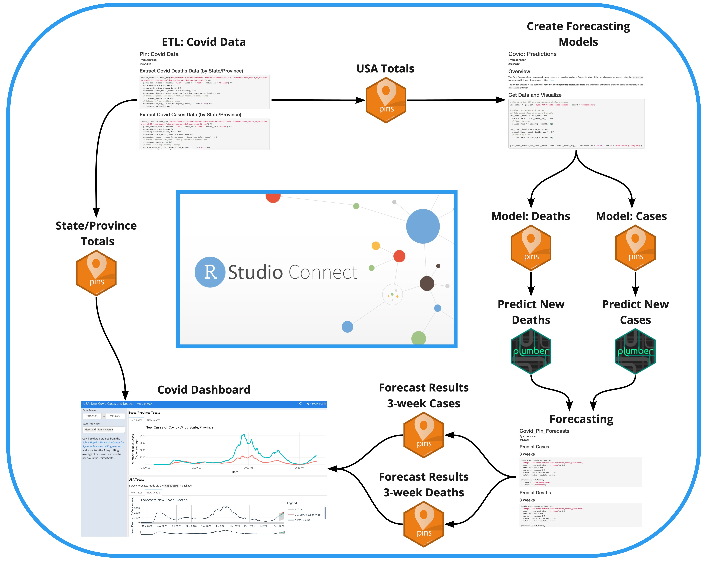

---
output:
  html_document:
    theme: flatly
editor_options: 
  chunk_output_type: console
---

`r gitlink::ribbon_css("https://github.com/ryjohnson09/New_Covid_Cases_USA", text="View on GitHub")`

```{css, echo=FALSE}
.main-container {
    width: 100%;
    max-width: unset;
}

.main {
    max-width: 940px;
    margin-left: auto;
    margin-right: auto;
}

.jumbotron {
  color: white;
  background-image: url("https://source.unsplash.com/w9KEokhajKw/1920x1080");
  background-position: center;
  background-repeat: no-repeat;
  background-size: cover;
  height: 50vh;
}
```

```{r setup, include=FALSE}
library(dplyr)
library(connectwidgets)
library(connectapi)
library(htmltools)
knitr::opts_chunk$set(echo = FALSE, message = FALSE, warning = FALSE)

# Set up connection
client <- connectwidgets::connect(
  server  = Sys.getenv("CONNECT_SERVER"),
  api_key = Sys.getenv("CONNECT_API_KEY")
  )

guids <- c("3776b35d-012b-46b3-8641-c4ec4f2f795d", # ETL Rmd
           "54b348bd-12c4-4791-9745-cb02ae5760f8", # Model Rmd
           "fcc9bf7e-cef9-456e-85b2-84146943345d", # Forecasting
           "31208e7f-f1d2-4872-8808-ff5e9a535ea4", # Pin: USA totals
           "18ed50cf-82bd-4cee-9c6c-3e2983d18cb6", # Pin: State/Prov totals
           "cf4318f4-7467-4cd1-ac21-d7d6b9b8a8c6", # Pin: Model (Cases)
           "deba2bf8-0014-4181-918b-2e2d1f842083", # Pin: Model (Deaths)
           "7afc831f-90a7-4652-9677-2706da43ec36", # Pin: 3 week pred (Cases)
           "3331ac8f-ca60-4678-b6de-506c9f357500", # Pin: 3 week pred (Deaths)
           "1bc446ed-3343-482f-b8d5-39437e0033a9", # API: Predict Cases
           "1eb4c0b7-faa2-4780-a7cc-dbf787564854", # API: Predict Deaths
           "561f7f69-d30a-47e0-8721-c1833c8b6237") # Dashboard

covid_content <- content(client = client) %>% 
  filter(guid %in% guids)
```

```{r}
div(
  class = "jumbotron jumbotron-fluid",
  div(
    class = "container",
    h1("Covid-19", class = "display-4"),
    p("New Covid-19 Cases in the USA")
  )
)
```



## Apps

```{r}
covid_content %>% 
  filter(guid == "561f7f69-d30a-47e0-8721-c1833c8b6237") %>% 
  rsc_card()
```

## Scheduled Jobs {.tabset}

Each scheduled job performs a task (ETL, modeling, forecasting) and [Pins](https://pins.rstudio.com/) to RStudio Connect.

### ETL

```{r}
covid_content %>%
  filter(guid == "3776b35d-012b-46b3-8641-c4ec4f2f795d") %>% 
  rsc_grid()
```

### Modeling

```{r}
covid_content %>%
  filter(guid == "54b348bd-12c4-4791-9745-cb02ae5760f8") %>% 
  rsc_grid()
```

### Forecasting

```{r}
covid_content %>% 
  filter(guid == "fcc9bf7e-cef9-456e-85b2-84146943345d") %>% 
  rsc_grid()
```


## Pins {.tabset}

### Models and Data
```{r}
covid_content %>% 
  filter(guid %in% c("31208e7f-f1d2-4872-8808-ff5e9a535ea4",
                     "18ed50cf-82bd-4cee-9c6c-3e2983d18cb6",
                     "cf4318f4-7467-4cd1-ac21-d7d6b9b8a8c6",
                     "deba2bf8-0014-4181-918b-2e2d1f842083")) %>% 
  rsc_table()
```

### Forecast Output {.tabset}
```{r}
covid_content %>% 
  filter(guid %in% c("7afc831f-90a7-4652-9677-2706da43ec36",
                     "3331ac8f-ca60-4678-b6de-506c9f357500")) %>% 
  rsc_table()
```


## APIs

```{r}
covid_content %>% 
  filter(guid %in% c("1bc446ed-3343-482f-b8d5-39437e0033a9",
                     "1eb4c0b7-faa2-4780-a7cc-dbf787564854")) %>% 
  rsc_card()
```