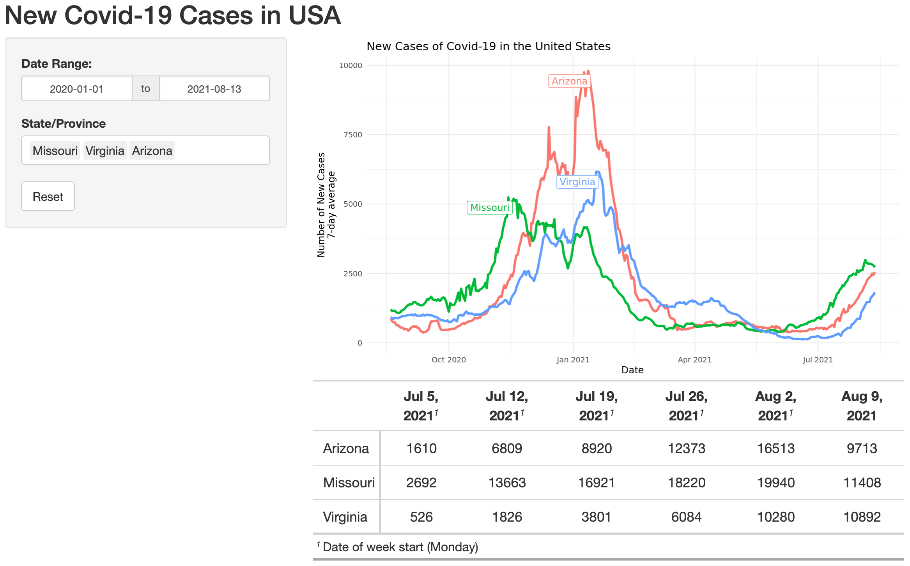

# New Covid-19 Cases in the United States

This parameterized R Markdown (with Blastula email) and Shiny app will show the number of new cases of Covid-19 in the USA (by State or Province).

* Data pulled from [COVID-19 Data Repository by the Center for Systems Science and Engineering (CSSE) at Johns Hopkins University](https://github.com/CSSEGISandData/COVID-19)

