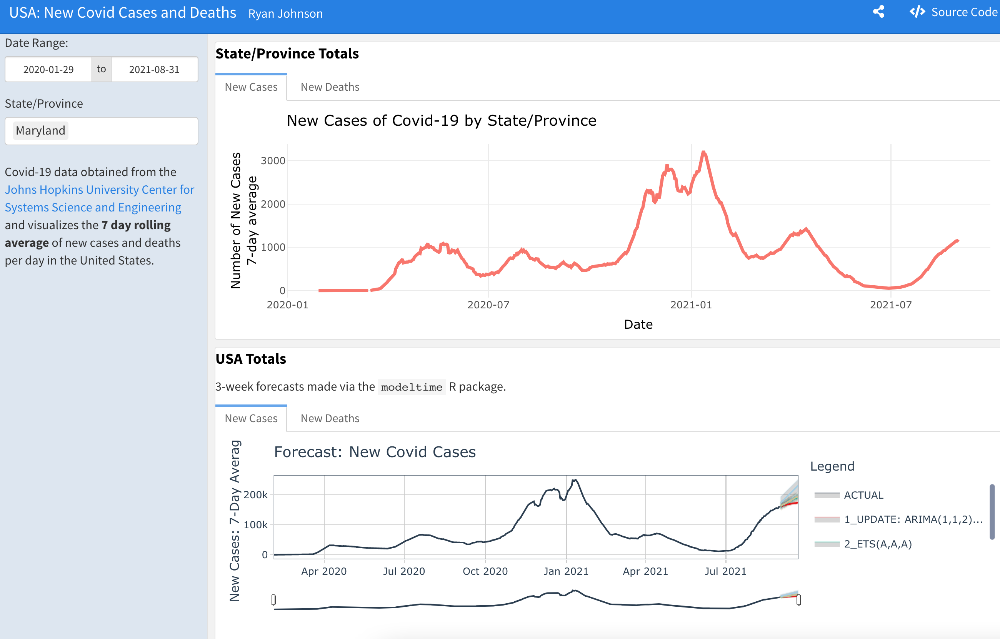

# New Covid-19 Cases and Deaths in the United States

This flexdashboard will show the number of new cases and deaths (7-day rolling average) of Covid-19 in the USA (by State or Province). It also makes 3-week forecasts using 5 different models for USA totals.

* Data pulled from [COVID-19 Data Repository by the Center for Systems Science and Engineering (CSSE) at Johns Hopkins University](https://github.com/CSSEGISandData/COVID-19)

